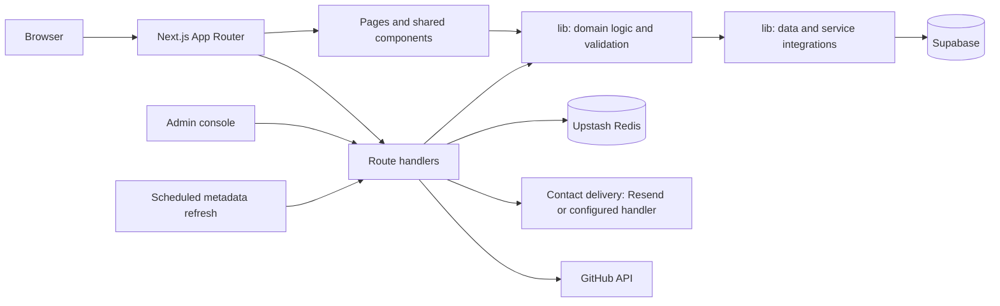

# AgentNine

AgentNine is a source-linked directory of AI-agent projects. It helps people find agents, review their source repositories, and follow setup guidance.

## Architecture



### Source layout

| Path | Responsibility |
| --- | --- |
| `app/` | Next.js routes, layouts, pages, metadata, and API endpoints |
| `components/` | Shared interface components |
| `lib/` | Data access, domain logic, validation, and service integrations |
| `public/` | Static images, fonts, and other public assets |
| Root config files | Dependencies and Next.js, TypeScript, CSS, and Vercel build configuration |

The app uses the Next.js App Router. Routes stay in `app/`; shared UI, application logic, and database access remain separate. This repository contains the deployable application source and this overview, not local notes or development-only material.

## Run locally

```bash
npm ci
npm run dev
```

Open <http://localhost:3000>. Configure required values in Vercel under **Project Settings → Environment Variables** for deployment, or in an untracked `.env.local` for local development. Keep service-role keys, admin keys, and provider credentials server-side; never commit them.

Without Supabase configuration, the directory can show an empty catalog. Do not treat that as a live database check.

## Data and deployment

The public catalog reads published agents and categories from Supabase. Configure the Supabase project and required credentials in Vercel before deploying database-backed features.

Production also depends on correctly configured server-side secrets, HTTPS, distributed rate limiting, and any enabled contact, reporting, or scheduled-task integrations. A successful local build does not confirm that production services or database migrations are ready.
