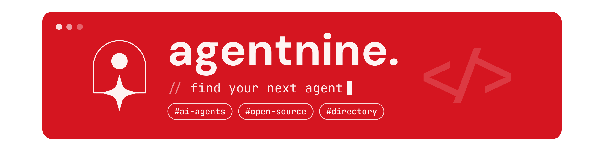

  

  
  
  
  
  
  

<strong>Find open-source AI agents. Understand the setup. Join the people building with them.</strong>

AgentNine is a community-led directory for discovering open-source AI agent projects. We bring together upstream repositories, practical setup notes, access requirements, and verification context so people can make informed choices and contribute back.

## A directory built with its community

AgentNine is more than a list of links. Each listing connects back to its source project and, where the information is available, helps people understand:

- How to install and start the project
- Which operating systems, hardware, ports, and environment variables it expects
- What access it requests, including files and network resources
- Which version was reviewed and when
- Common setup issues and how to remove the software

These notes are a starting point, not a security audit or endorsement. Always review the original project and its documentation.

We are building AgentNine as a community and expect the people contributing to it to grow over time. If you work with open-source agents, maintain a project, or spot a detail that needs correcting, [join the community](https://agentnine.pro/join) or [suggest a correction](https://agentnine.pro/contact).

## Technology

  
  
  
  
  
  
  

The product is built with Next.js and React, with TypeScript, Tailwind CSS, Supabase, and Vitest. Production hosting and connected services depend on project configuration.

## People behind AgentNine

We are starting small and making room for more community contributors. The profiles below link to the platforms each person has shared.

<table>
  <tr>
    <td align="center" valign="top" width="50%">
      
       <strong>Nilesh</strong>
       Founder &amp; Tech Lead
        
      
      
      
    </td>
    <td align="center" valign="top" width="50%">
      
       <strong>Ali Sibtain</strong>
       Marketing Lead
        
      
      
    </td>
  </tr>
  <tr>
    <td align="center" valign="top" colspan="2">
      
       <strong>Arman Amba</strong>
       AI Developer
        
      
    </td>
  </tr>
</table>

## Be part of what comes next

AgentNine is being built in the open. You can [join the community](https://agentnine.pro/join), share feedback, help improve project notes, or [report a correction](https://agentnine.pro/contact).

Follow [AgentNine on GitHub](https://github.com/Nilesh1735/AgentNine), [LinkedIn](https://www.linkedin.com/company/agentnine/), [X](https://x.com/agentninepro), [Instagram](https://www.instagram.com/agentnine.pro), and [Facebook](https://www.facebook.com/share/1DeKsDQoQ7/).
